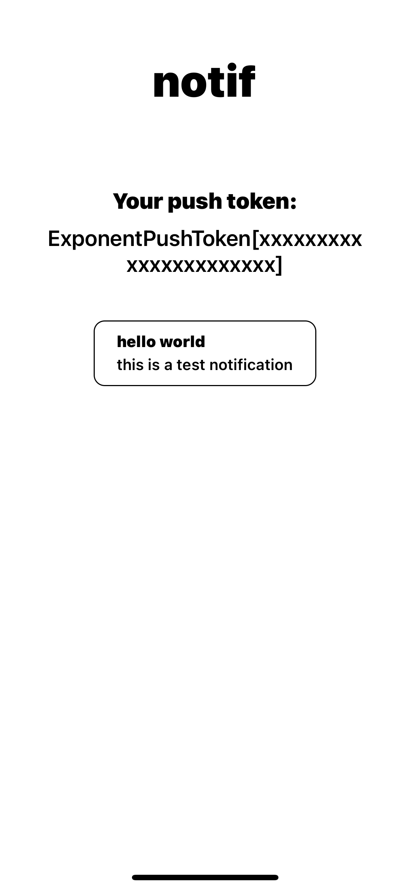

# notif

Programmatically send custom push notifications to your phone. Implemented using Expo.



## Features

- Send a push notification to your phone from anywhere
- Push notification history (only while the app is open 🤔)

## Installation

1. Clone this repo
2. `npm install`
3. Download 'Expo Go' on your physical device (this won't work in the simulator)
4. `expo start`
5. Scan the QR code with your Camera app

## Sending Push Notifications

1. Grab the push token from your device. Keep this a secret!

   (TIP: Tap the token to copy it to the clipboard)

2. Send a request to [Expo's Push API](https://docs.expo.dev/push-notifications/sending-notifications/#http2-api):

   ```shell
   curl -H "Content-Type: application/json" -X POST "https://exp.host/--/api/v2/push/send" -d '{
      "to": "ExponentPushToken[xxxxxxxxxxxxxxxxxxxxxx]",
      "title":"hello",
      "body": "world"
   }'
   ```

   See [this doc](https://docs.expo.dev/push-notifications/sending-notifications/#formats) for more info.
